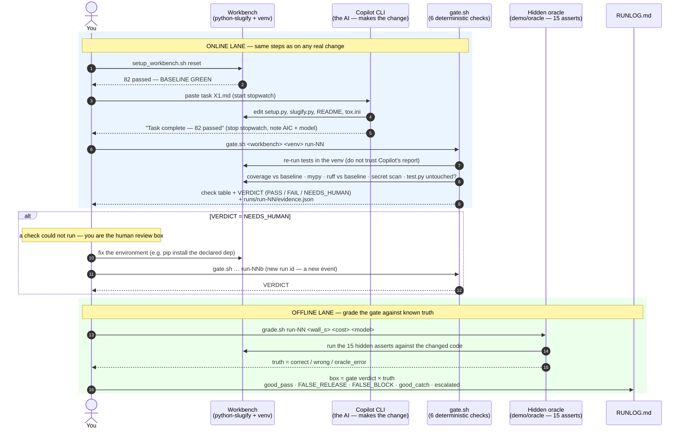
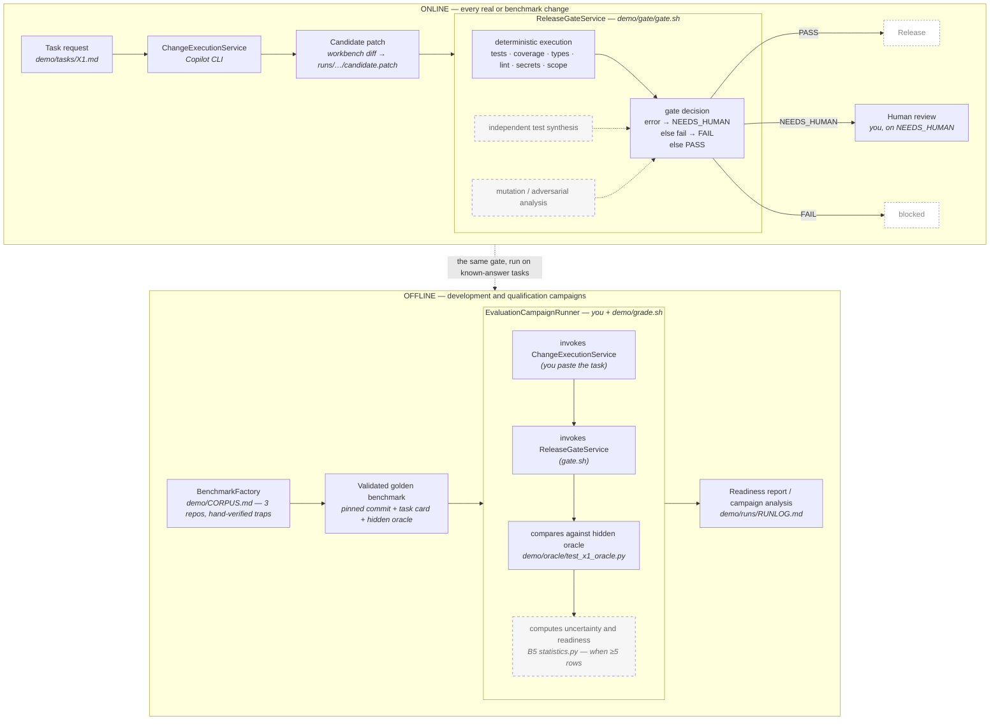

# Diagrams

> **Legacy demo:** These diagrams describe `demo/gate/gate.sh`; they are not
> the architecture of the reusable [`release-gate/`](../release-gate/README.md)
> product.

Two diagrams, in Mermaid. GitHub renders them in place; draw.io imports them
via *Arrange → Insert → Advanced → Mermaid* (paste the block); most IDEs
preview them.

## 1. One run, end to end — what actually happens

This is the sequence you drive by hand in `RUN.md`. The dashed line is the
boundary between the ONLINE lane (what would happen on any real change) and
the OFFLINE lane (grading the gate against the answer key). Notice the oracle
takes part only below the line, and Copilot only above it.

## 2. The HLD, mapped onto the demo

The manager's HLD has two lanes and a small set of boxes. This shows which
file plays each box today. Boxes drawn dashed exist in the HLD but are not
part of the demo yet.

Reading the second diagram: the demo fills every solid box. The dashed boxes
are the honest gaps — two of the gate's three evidence engines in the HLD
(test synthesis, mutation analysis) are not built, and the statistics step
waits for enough rows to summarise. "Release" is dashed because the demo ends
at the gate decision on purpose (`prompts/prompt_truncate.txt`).
