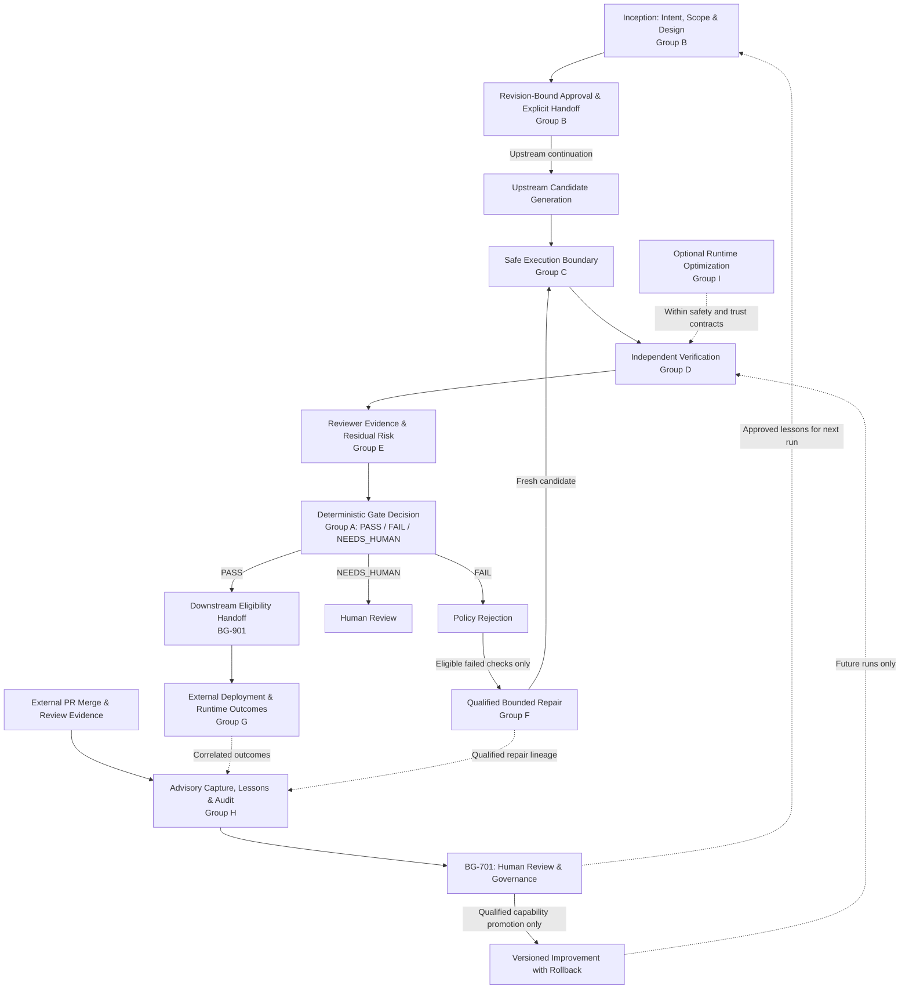

# Release Gate Backlog for an AI-Driven Development Lifecycle

## Purpose & Reading Order

Build a release gate that checks approved intent, verifies candidates safely,
helps humans judge residual risk, and learns from delivery outcomes. The backlog
is organized by AIDLC responsibility rather than by the order ideas were added.

**Reorganized 2026-09-13:** Existing BG IDs, priorities, and item acceptance
criteria are preserved. Lettered capability groups replace the historical epic
headings; ID prefixes remain stable references, not delivery sequence numbers.
The roadmap gives implementation order, while the diagram shows lifecycle flow.
This is a documentation reorganization, not a new implementation-status audit.

The gate remains a deterministic evaluator of recorded, base-trusted policy.
Upstream workflows own planning, code generation, document updates, approvals,
and continuation. Downstream systems own deployment. The learning layer proposes
reviewed changes for future runs. None may silently rewrite finalized evidence.

## Implementation Roadmap

Build the core gate in dependency order. Keep the previously agreed advisory
learning pilot running in parallel; do not require a full lifecycle rollout before
capturing useful PR evidence. The old Q1/Q2/Q3 labels are replaced by readiness
criteria rather than implied delivery dates.

| Delivery wave | Items / sequence | Readiness and dependencies |
| :--- | :--- | :--- |
| **0. Contracts, provenance & repair baseline** | BG-503 → BG-502; BG-901; BG-402; BG-704 → BG-702 → BG-703 → BG-705 | Stable verdict/routing contract, reviewable evidence identity, explicit downstream handoff, and qualified repair behavior. Neighboring existing capabilities are not assumed to satisfy the full backlog criteria. |
| **1. Intent & risk-aware collaboration** | BG-1101 + BG-101 → BG-1103; BG-201 → BG-1102; BG-1104 → BG-1105 | Build on Wave 0 provenance and contracts. Capture original intent first; use it for design consistency, evidence profiles, revision-bound approvals, and cross-owner handoff. Start advisory; semantic blocking waits for BG-202. |
| **2. Safe verification boundary** | BG-301 → BG-302; BG-803 | Qualify isolation, leakage checks, and producer trust contracts before executing untrusted candidates or generated verification. This work can proceed alongside Wave 1. |
| **3. Independent assurance & reviewer evidence** | BG-801 → BG-802 → BG-804; BG-102; BG-202; BG-401 | Reuse reviewed intent, producer contracts, and execution safety. Property-based evidence extends the synthesis/adversarial work. Calibrate subjective findings before enabling blocking use. |
| **4. Operational integration** | BG-501; BG-902 → BG-903 | Add capacity-aware workflow routing and runtime correlation using the Wave 0 handoff. Missing runtime data is explicit; completed verdicts remain immutable. |
| **5. Qualified capability promotion** | Complete BG-701 promotion/requalification controls with BG-1006 proposals | Promote only reviewed, benchmark-qualified, versioned changes with rollback records. Runtime evidence enriches this loop when available; it is not required for PR-only proposals. |
| **6. Optional efficiency optimization** | BG-601 + BG-603 → BG-602 | Requires Wave 2 safety and producer contracts. Measure latency/cost benefits before adding automatic mode routing; this is not on the core assurance critical path. |

**Parallel advisory pilot:** Establish BG-701 approval/provenance rules and
BG-1007 measurement from the start; deliver BG-1001 → BG-1002 → BG-1003 →
BG-1004, then BG-1005 → BG-1006. Read-only collection needs no deployment or
sandbox rollout. Repair lesson reuse waits for Wave 0 qualification. Capability
promotion waits for Wave 5 controls; generating proposals does not authorize
applying them. Cross-repository sharing and automatic improvement PR creation
remain deferred.

## Strategic Capabilities & Backlog Items

Group letters indicate responsibility, not a requirement for a single monolithic
workflow. Group A contracts apply throughout; evidence capture and audit stay
outside the live decision path. Human approval does not automatically execute,
merge, or deploy anything. Missing-evidence workflow routes must map to the
stable verdict contract under BG-503.

### A. Foundation — Decision & Handoff Contracts

Define the stable decision and integration boundaries before adding controls. BG-503 governs interpretation of historical routing labels in BG-502: the engine emits only `PASS`, `FAIL`, or `NEEDS_HUMAN`; richer routes belong to adapters. A passing gate does not deploy software.

| Item ID | Title | Priority | Description & Acceptance Criteria |
| :--- | :--- | :---: | :--- |
| **BG-503** | **Stable Verdict Contract vs. Workflow Routing Clarification** | High | **Problem:** Architecture diagrams and integrations can conflate the stable v1 verdict contract with richer workflow routing states such as release, deploy, human review, or more-evidence loops. **Implementation:** Document and enforce a translation layer: the engine emits only contract verdicts unless the result schema is versioned; downstream workflow adapters may derive routing labels from verdict, reason codes, severity, and policy metadata. **Acceptance Criteria:** Documentation, schemas, and integration examples distinguish `PASS` from deployment authorization, `NEEDS_HUMAN` from generic failure, and any future `MORE_EVIDENCE_REQUIRED` route from the stable v1 result enum. |
| **BG-502** | **Multi-Tiered Three-Way Gate Policy Engine** | High | **Problem:** Binary pass/fail is insufficient for agent workflows where changes need distinct routing (automatic merge vs. human sign-off vs. additional evidence). **Implementation:** Ensure robust three-way policy evaluation (`PASS`, `FAIL`, `HUMAN_REVIEW_REQUIRED`, `MORE_EVIDENCE_REQUIRED`) based on control severity, metric thresholds, and flake rates. **Acceptance Criteria:** Changes with minor non-blocking advisory warnings are cleanly escalated to human reviewers without blocking unrelated pipeline steps. |
| **BG-901** | **Post-PASS Deployment Eligibility Contract** | Medium | **Problem:** Diagrams that end with “Release” can imply the gate deploys software. A `PASS` means the candidate satisfied recorded pre-release policy, not that a deploy controller has executed rollout checks. **Implementation:** Define a downstream handoff contract that carries verdict, candidate tree, evidence manifest digest, policy digest, and residual-risk summary to CI/CD systems without granting the gate deployment authority. **Acceptance Criteria:** Integration docs and examples use “eligible for downstream deployment” language and require deploy systems to make their own environment, rollout-window, and approval checks. |

### B. Inception — Intent, Scope, Design & Approvals

Establish what is being built, why, how much risk it carries, and who approved the relevant revisions. Upstream teams create and revise these artifacts; Release Gate validates evidence. Approval and continuation remain separate actions. Initial intent capture can start before advanced semantic conformance is available.

| Item ID | Title | Priority | Description & Acceptance Criteria |
| :--- | :--- | :---: | :--- |
| **BG-1101** | **Original Intent & Decision Provenance** | High | **Problem:** A generated spec can omit why a requirement exists and which assumptions a human actually accepted. **Implementation:** Define a versioned upstream intent record linking source requirements, clarified questions/answers, accepted decisions, unresolved assumptions, acceptance criteria, and selected work-unit scope. Distinguish original human input from model summaries; link revisions and artifact digests into gate evidence. **Acceptance Criteria:** A reviewer can trace a requirement through its rationale to verification evidence. Changes append superseding decisions instead of rewriting approved history. Deferred work and unresolved questions remain visible. Sensitive conversation content is minimized/redacted; a complete raw chat transcript is not required. A candidate-authored summary alone cannot claim human approval. **Dependencies:** Extend BG-201/BG-402; supply provenance to BG-1002/BG-1003. |
| **BG-101** | **Configurable Diff Size & Blast Radius Gate** | High | **Problem:** Massive agent diffs trigger severe reviewer fatigue (>400 lines) and drop defect detection to <70%. **Implementation:** Add a diff budget evaluator into the release gate policy schema (`max_lines_changed`, `max_files_modified`, `max_cyclomatic_complexity_delta`). **Acceptance Criteria:** Gate returns `FAIL` or `HUMAN_REVIEW_REQUIRED` if diff metrics exceed the configured review budget, prompting agent task decomposition. |
| **BG-1103** | **Risk-Based Lifecycle Evidence Profiles** | High | **Problem:** A single heavyweight process invites bypasses, while a lightweight process can omit critical analysis for risky changes. **Implementation:** Use base-trusted profiles to select required intent, design, security, testing, and approval evidence by change type and sensitivity. Record profile selection, reasons, and explicit not-applicable decisions. Existing-system changes reference relevant current behavior; small fixes can use a minimal profile. Upstream planning selects a bounded work unit and retains deferred requirements. **Acceptance Criteria:** Small-fix, new-feature, existing-system, and security-sensitive fixtures select the expected evidence requirements. Candidate content or a casual opt-out cannot disable mandatory controls. Unknown risk is surfaced for review. Frontend or non-functional labels alone do not justify skipping user-impact analysis. Workflow adapters load only relevant guidance and preserve restart state. **Dependencies:** BG-101/BG-503 and BG-1101; profile selection remains distinct from BG-602 execution-mode routing. |
| **BG-201** | **Architectural Decision Record (ADR) Conformance Evaluator** | High | **Problem:** Agents make subtle architectural deviations that compile and pass unit tests but violate team architectural intent. **Implementation:** Implement an architectural fitness function evaluator that checks candidate diffs against versioned ADRs, task specifications, and package boundary rules. **Acceptance Criteria:** Non-conforming changes emit structured conformance failure findings referencing the violated ADR rule. |
| **BG-1102** | **Specification, Design & Implementation Consistency** | High | **Problem:** Requirements, design, tasks, and tests can diverge as implementation changes, leaving individually plausible but contradictory artifacts. **Implementation:** Track impacted artifact links and acceptance-criterion-to-check mappings. Detect stale revisions, missing references, and absent required evidence deterministically; report semantic contradictions separately as advisory findings. Upstream workflows prepare any document corrections for review. **Acceptance Criteria:** Fixtures cover a changed acceptance criterion with an old test mapping, a task/design conflict, and a behavior change with stale documentation. Findings identify affected artifact revisions and required re-review. The gate does not rewrite documents, treat file existence as semantic consistency, or certify an LLM judgment as proof. **Dependencies:** BG-1101 and BG-201; subjective blocking requires BG-202 qualification. |
| **BG-1104** | **Revision-Bound Role Approval Evidence** | High | **Problem:** An approval mark can refer to outdated documents or lack trustworthy reviewer identity and authority. **Implementation:** Record the approving actor, trusted identity source, required role, decision, time, and exact artifact revision/digest under base-trusted role policy. Require renewed approval when the covered artifact changes; support append-only rejection, supersession, and revocation records. **Acceptance Criteria:** Stale, revoked, missing, or unauthorized approvals cannot satisfy a required approval control. A product reviewer and technical reviewer satisfy only the roles assigned by trusted policy. Local git name/email is attribution metadata, not authenticated identity. Pilot findings are advisory; later enforced missing approval routes through `NEEDS_HUMAN`, while integrity violations follow existing failure policy. **Dependencies:** BG-1101/BG-1103 and BG-402/BG-503. |
| **BG-1105** | **Approval, Handoff & Execution Separation** | Medium | **Problem:** Approving requirements must not start coding or deployment in the reviewer's environment, and resuming elsewhere must not reuse stale stage state. **Implementation:** Define an upstream handoff record with approved artifacts, pending work, next responsible role, and a separate explicit continuation action. Support native assistant question tools while persisting decisions in portable artifacts. **Acceptance Criteria:** Approval alone triggers no execution. Another authorized owner can resume from the handoff and must revalidate artifact revisions and unresolved requirements. Duplicate continuation does not repeat completed stage work. No specific IDE, command vocabulary, or AIDLC directory layout is required. Gate `PASS` remains eligibility evidence, not execution or deployment authorization. **Dependencies:** BG-1103/BG-1104 and BG-901; orchestration remains upstream. |

### C. Construction — Execution Safety

Establish the execution boundary before running untrusted candidates or generated verification. Existing trusted-host execution remains a limitation until these controls are delivered.

| Item ID | Title | Priority | Description & Acceptance Criteria |
| :--- | :--- | :---: | :--- |
| **BG-301** | **Hard Sandbox Execution Integration (Container / MicroVM)** | High | **Problem:** Worktrees and local clean clones do not isolate process credentials, host daemon sockets, environment variables, or local network services. **Implementation:** Integrate the release gate verifier with container/user-space sandboxes (e.g., OCI containers, Firecracker, or gVisor) with default `deny_all` network egress. **Acceptance Criteria:** Evaluation runs in an isolated ephemeral execution sandbox with stripped environment credentials and strictly bounded resources (CPU, RAM, wall-clock time). |
| **BG-302** | **Credential & Environment Leakage Scanner** | Medium | **Problem:** Agents might accidentally output or commit ambient tokens, secrets, or modified environment configurations. **Implementation:** Pre-gate and post-gate verification that inspects candidate patches, artifacts, and test runner logs for credential patterns and out-of-boundary path writes. **Acceptance Criteria:** Zero token or sensitive environment variable presence in generated evidence directories or candidate diffs. |

### D. Construction — Independent Verification

Register evidence sources and trust classes before expanding verification. Property-based and mutation tests complement reviewed acceptance criteria; they do not guarantee a correct oracle. Subjective findings remain advisory until BG-202 qualification and explicit trusted policy allow a blocking contribution.

| Item ID | Title | Priority | Description & Acceptance Criteria |
| :--- | :--- | :---: | :--- |
| **BG-803** | **Evidence Producer Registry & Trust Labels** | Medium | **Problem:** As checks expand beyond repository-declared commands, reviewers need to know which evidence came from deterministic tools, generated tests, model judgments, or downstream runtime signals. **Implementation:** Add a producer registry with stable IDs, versions, trust class, determinism class, required sandbox profile, and allowed verdict contribution. **Acceptance Criteria:** `result.json` or an associated evidence summary can group controls by producer and label each as deterministic, bounded-generated, subjective, downstream, or advisory. Blocking policy may only use producer classes explicitly enabled by base-trusted configuration. |
| **BG-801** | **Independent Test Synthesis Evidence Producer** | High | **Problem:** Candidate-authored tests can pass while preserving the agent's blindspot, and synthesized tests are currently represented only as a diagram concept rather than a governed evidence source. **Implementation:** Add an optional producer that generates or selects independent tests from task intent, changed APIs, bug classes, and historical incidents, then executes them in the same isolated gate runtime as other controls. **Acceptance Criteria:** Generated tests are stored as untrusted evidence artifacts with generator version, prompt/input digest, changed-path scope, execution result, and reviewer-visible limitations. The gate decision consumes only the recorded result and configured policy threshold. |
| **BG-802** | **Mutation & Adversarial Case Analysis Producer** | High | **Problem:** Ordinary deterministic tests can miss boundary, negative, and regression cases that are common in agent-generated code. **Implementation:** Add mutation/adversarial runners that create bounded mutants or adversarial fixtures for changed units, prioritize them by blast radius, and report survivor classes without modifying the candidate tree. **Acceptance Criteria:** Evidence identifies killed/surviving mutants, adversarial scenario IDs, affected paths, runtime cost, and policy contribution. Surviving high-severity cases can produce `FAIL` or `NEEDS_HUMAN`; inconclusive runs never produce `PASS`. |
| **BG-804** | **Property-Based & Metamorphic Test Evidence** | High | **Problem:** Example-based tests can miss boundary cases, and candidate-authored tests can repeat the implementation's assumptions. **Implementation:** Extend BG-801/BG-802 with bounded property-based and metamorphic checks derived from reviewed invariants, domain rules, and acceptance criteria. Record property/generator versions, seeds, execution budgets, and minimized counterexamples as independent evidence. **Acceptance Criteria:** A failing run can be replayed from its recorded seed or saved counterexample. Vacuous properties and excessive discarded inputs are reported; timeout or incomplete required evidence cannot silently count as success. Candidate changes cannot weaken trusted properties or their oracle. Random inputs alone are not evidence of an independent or correct oracle. Results use existing verdict policy and do not modify the candidate tree. **Dependencies:** BG-801/BG-802/BG-803 and their execution-safety controls; BG-1101 supplies reviewed intent when available. |
| **BG-102** | **Code Duplication & Syntactic Bloat Detector** | Medium | **Problem:** Agents often duplicate boilerplate/logic rather than reusing abstractions, multiplying state-reconstruction overhead. **Implementation:** Add static duplication analysis check comparing candidate patch against base repository AST. **Acceptance Criteria:** Flag or fail changes that introduce duplicate AST blocks beyond configurable similarity thresholds. |
| **BG-202** | **LLM-as-a-Judge Calibration & False-Positive Monitoring** | High | **Problem:** Subjective semantic drift checks can hallucinate or exhibit length/position bias. If false-positive rates exceed 20–30%, teams disable the tool. **Implementation:** Establish a continuous evaluation harness comparing LLM conformance judgments against a gold-standard dataset of human reviews. Track and report the false-positive rate as a gate reliability metric. **Acceptance Criteria:** Drift evaluators cannot run in blocking mode unless their empirical false-positive rate on benchmark sets remains strictly under 15%. |

### E. Release Review — Evidence & Reviewer Capacity

Present the system delta, control provenance, and unresolved risk so reviewers can make an informed decision. Build BG-402 provenance alongside the foundation because approval evidence depends on it; reviewer capacity throttling is a later workflow integration.

| Item ID | Title | Priority | Description & Acceptance Criteria |
| :--- | :--- | :---: | :--- |
| **BG-401** | **State-Mutation & Non-Local Side-Effect Delta Summary** | High | **Problem:** Reviewers waste significant time scanning diffs to identify which external dependencies, public contracts, or global states were altered. **Implementation:** Add an evidence summarizer that extracts public API contract changes, database schema alterations, configuration modifications, and cross-module call-graph shifts. **Acceptance Criteria:** `evidence/summary.md` features a high-visibility "System State Delta" section separating mechanical code edits from architectural/state boundary changes. |
| **BG-402** | **Automated Decision Provenance & Confidence Ledger** | Medium | **Problem:** Reviewers need clarity on which portions of the change are 100% verified by deterministic proofs vs. requiring subjective human evaluation. **Implementation:** Include a verification ledger in the gate report categorizing each control: Deterministic Proofs (mutation score, type checks, coverage), Boundary Guarantees (diff budget, sandbox validation), and Subjective Areas requiring review. **Acceptance Criteria:** Reviewers receive an unambiguous list of items requiring manual scrutiny, reducing review time per PR. |
| **BG-501** | **Weekly Merge Budget & Review Queue Throttling** | Medium | **Problem:** Generating changes faster than the team's review budget creates toxic review queues and rushed approvals. **Implementation:** Expose team-level review capacity metrics (`merge_budget = review_hours * lines_per_hour`) and gate concurrency throttles in workflow integrations. **Acceptance Criteria:** Workflow integration warns or holds low-priority agent PRs when the active review queue exceeds the calculated weekly review capacity. |

### F. Failed Verification — Bounded Repair & Qualification

Qualify the repair workflow, expose useful diagnostics, and preserve accurate attempt lineage before reusing repair lessons. Repair produces a fresh candidate for reevaluation; it cannot change the original verdict or silently expand approved scope. BG-701 learning governance now appears with the learning loop below.

| Item ID | Title | Priority | Description & Acceptance Criteria |
| :--- | :--- | :---: | :--- |
| **BG-704** | **Repair Integration Qualification Health** | High | **Problem:** The repair integration suite currently fails before exercising the workflow because `tests/test_repair_integration.py` uses `sys.executable` without importing `sys`. **Implementation:** Repair the test harness and make the qualification suite run the full C0/C1/C2, repeated-candidate, needs-human, guidance, and lesson-content scenarios. **Acceptance Criteria:** Ruff is clean, all repair integration tests execute (not collection-fail), and CI blocks release qualification on any harness error. |
| **BG-702** | **Expose Structured Repair Guidance to the Assistant** | High | **Problem:** `request_repair()` computes check-specific playbook guidance, but the `repair-request` CLI drops it, leaving the assistant with only failed check IDs and paths. **Implementation:** Return guidance plus safe references to the latest result and execution logs, clearly marked as untrusted diagnostic data. **Acceptance Criteria:** CLI and skill contract tests assert that guidance and diagnostic artifact locations reach every repair attempt without expanding approved paths or changing the verdict. |
| **BG-703** | **Persist Accurate Passing-Candidate Lessons** | High | **Problem:** The success lesson proposal is generated from the pre-success session, so it cannot identify the candidate that just passed and is too generic to be reusable. **Implementation:** Generate the proposal from the updated attempt lineage and include failure fingerprint, changed paths, verification evidence, and the successful remediation pattern. **Acceptance Criteria:** A passing `C1`/`C2` proposal names the passing candidate, references its evidence, and is available to the governed learner; failed candidates remain preserved. |
| **BG-705** | **Structured Repair Outcome Dataset & Lineage** | Medium | **Problem:** `RepairAttempt` stores hashes and verdicts but does not provide a normalized failure fingerprint, human outcome, cost, or causal classification for future analysis. **Implementation:** Add a versioned, append-only repair outcome record linked to every candidate and gate run. **Acceptance Criteria:** Learner inputs distinguish failed, corrected, abandoned, and rolled-back attempts; records include checks, artifacts, paths, timing/token cost where available, and immutable candidate lineage without exposing secrets. |

### G. Operations — Runtime Outcomes & Escaped Defects

After the downstream handoff, ingest and correlate canary failures, incidents, rollbacks, and hotfixes. Operations remain outside the gate; append-only outcomes inform future work without rewriting completed decisions.

| Item ID | Title | Priority | Description & Acceptance Criteria |
| :--- | :--- | :---: | :--- |
| **BG-902** | **Runtime Guardrail Signal Ingestion** | Medium | **Problem:** Live incidents, rollback triggers, SLO breaches, and canary failures are valuable learning inputs but are outside current gate evidence and verdict finalization. **Implementation:** Add an append-only ingestion format for downstream runtime signals linked to candidate tree, release artifact, gate run ID, and deployed environment. **Acceptance Criteria:** Runtime signals cannot alter a completed `result.json`; they can create governed learning proposals, benchmark additions, policy-review tasks, or reviewer warnings for future runs. |
| **BG-903** | **Rollback and Incident Outcome Correlation** | Medium | **Problem:** Without correlation between gate evidence and production outcomes, teams cannot tell which blindspots escaped the gate or whether new checks reduce real incidents. **Implementation:** Correlate rollback, hotfix, incident, and human-review outcomes with gate controls, producer classes, diff metrics, and repair lineage. **Acceptance Criteria:** Periodic reports identify escaped-defect classes, false-positive controls, missing evidence producers, and candidate patterns that should update benchmarks or policy proposals through BG-701. |

### H. Learning — Capture, Reuse, Audit & Governed Improvement

Apply governance before approving reusable lessons or promoting capability changes. Capture and measurement can begin immediately in the agreed single-repository advisory pilot; production correlation is not a prerequisite for learning from PR reviews. Measurements in BG-1007 run throughout, not only after the other items.

| Item ID | Title | Priority | Description & Acceptance Criteria |
| :--- | :--- | :---: | :--- |
| **BG-701** | **Governed Repair Feedback Learning Loop** | High | **Problem:** Repair sessions and rolling observability are recorded, but no later session consumes them to improve diagnosis or repair behavior. **Implementation:** Add a separate learner that consumes repair outcomes, human decisions, rollbacks, incidents, and new failure modes; generate versioned proposals for prompts, playbooks, benchmark cases, or model routing. **Acceptance Criteria:** Proposals are never applied automatically; each has provenance, an approver, a capability version, requalification evidence on a frozen benchmark, and a reversible promotion/rollback record. |
| **BG-1001** | **Post-Merge Evidence Capture** | High | **Problem:** Gate decisions and repair outcomes lack the subsequent PR review context needed for learning. **Implementation:** Add a separate workflow that captures PR identity, reviewed revision, merge revision, review threads, linked acceptance criteria, CI attempts, and available gate-run references. Use explicit revision/tree evidence for correlation rather than assuming a PR's latest run verified its merged contents. **Acceptance Criteria:** Reprocessing the same evidence is idempotent; later evidence is recorded with provenance. No-comment PRs are captured. Missing data, incomplete pagination, and uncertain squash/rebase correlations are explicit. Closed-unmerged PRs cannot be labeled successful merges. Finalized gate artifacts are never rewritten. **Dependencies:** Existing result/manifest identity; align repair references with BG-705. |
| **BG-1002** | **Evidence-Linked PR Health Assessment** | High | **Problem:** A merged PR can lack recorded intent, meaningful review, or clean verification without yielding any review comment from which to extract a lesson. **Implementation:** Assess specification coverage, design rationale, security/SRE sensitivity, review quality, and CI health before extracting lessons. Distinguish missing evidence from confirmed deficiencies and CI retries from demonstrated flakiness. **Acceptance Criteria:** Every assessment includes source references and coverage limitations, including PRs with zero comments. Comment count, diff size, or phrases such as “LGTM” alone cannot establish inadequate review. Risky-path review gaps and unacknowledged critical findings are advisory findings requiring verification. **Dependencies:** BG-1001; align future risk routing with BG-101/BG-503. |
| **BG-1003** | **Governed Lesson Extraction & Lifecycle** | High | **Problem:** Useful review feedback stays in closed threads, while generic or duplicate lessons can overwhelm future context. **Implementation:** Create structured proposals with category, learning, evidence, application scope, source PR/revision, and lifecycle status. Use the article's categories: Edge Case, Integration Gotcha, Performance Cliff, Security Trap, Process Friction, Domain Rule, and Tooling Quirk. Store approved repository lessons in `docs/learnings/` with stable IDs and versions. **Acceptance Criteria:** Human approval is required before reuse. Duplicate proposals retain source provenance without multiplying active lessons; contradictory evidence is flagged for review. Rejected, superseded, and retired lessons remain traceable. Sanitize sensitive content and treat review text as untrusted data, not executable instructions. **Dependencies:** BG-1002 and BG-701 governance; integrate accurate repair lessons through BG-703/BG-705. |
| **BG-1004** | **Active, Bounded Lesson Retrieval** | High | **Problem:** A write-only learning directory cannot improve subsequent work. **Implementation:** Let upstream planning and repair workflows select approved lessons using changed paths, check IDs, and failure patterns. Record the IDs and versions actually supplied to each run, with a configurable context budget. **Acceptance Criteria:** Demonstrate a reviewed lesson from one PR appearing in a later relevant run. Irrelevant, unapproved, retired, expired, or superseded lessons are excluded; no-match cases are explicit. Retrieved content cannot override base-trusted policy, expand approved repair paths, or alter a finalized verdict. **Dependencies:** BG-1003; BG-702 for the repair guidance channel. |
| **BG-1005** | **Periodic Advisory PR Audit** | Medium | **Problem:** Individual lessons do not reveal repeated specification, design, skill, or review-practice gaps across PRs. **Implementation:** Analyze a bounded batch for those four dimensions, verify every proposed finding against its evidence, and synthesize recurring patterns. Include positive practices and team-level trends without reviewer rankings. **Acceptance Criteria:** Findings include evidence, confidence, frequency denominators, and collection limitations. Human-labeled samples measure false positives, including terse but substantive reviews. Suspected high-risk review gaps are escalated for human assessment; heuristic review-quality scores never block the pilot. **Dependencies:** BG-1001/BG-1002; reuse BG-202 calibration principles before any later enforcement proposal. |
| **BG-1006** | **Evidence-Linked Improvement Proposals** | Medium | **Problem:** Audit reports can accumulate without producing a concrete improvement to future behavior. **Implementation:** Convert verified recurring findings into reviewable recommendations for playbooks, skills, intent documentation, and regression cases. Each proposal identifies the target artifact, proposed change, source PRs/lessons, expected benefit, and validation approach. **Acceptance Criteria:** A reviewer can trace each recommendation to verified evidence and accept or reject it. Capability changes follow BG-701 approval, versioning, frozen-benchmark requalification, and reversible promotion. The pilot neither applies proposals automatically nor creates external PRs automatically. **Dependencies:** BG-1003/BG-1005 and BG-701; future generated evidence follows BG-801/BG-803. |
| **BG-1007** | **Learning Effectiveness, Cost & Maintenance** | Medium | **Problem:** More lessons and higher pass rates do not demonstrate fewer blindspots. **Implementation:** Measure capture coverage, lesson approval/reuse, human-sampled audit precision, recurring failure patterns, processing time, and model cost where available. Support periodic lesson retirement and supersession. **Acceptance Criteria:** Reports state denominators, observation windows, unavailable values, and sampling limitations. Establish a baseline before claiming improvement; distinguish correlation from causation. Collection and model work have bounded batch/context budgets, and truncation is visible. Production escape metrics remain unavailable until BG-902/BG-903 supplies correlated outcomes. **Dependencies:** Instrument BG-1001 onward; use BG-1004 consumption records and BG-1005 labeled samples. |

### I. Optimization — Verification Runtime Efficiency

Optimize multi-step verification only after the safety boundary and evidence contracts are established. Deliver runtime diagnostics with the SDK before automatic execution-mode routing. Code Mode is an optimization track, not a prerequisite for an effective AIDLC release gate; validate performance targets against a measured baseline.

| Item ID | Title | Priority | Description & Acceptance Criteria |
| :--- | :--- | :---: | :--- |
| **BG-601** | **Code Mode Verification SDK & Execution Runtime** | High | **Problem:** Multi-step verification (e.g. running tests, inspecting failures, filtering flaky tests, re-running focused sub-suites, parsing coverage) via traditional Function Calling causes high latency, token bloat, and fragile multi-turn loops. **Implementation:** Expose release gate verification primitives as a typed local Python/TS SDK within a single sandboxed code-runner endpoint (`execute_verification_script`). Allow the agent to write scripts with native loops (`for`, `while`), branches (`if/else`), and data aggregations. **Acceptance Criteria:** Complex verification tasks execute in a single round-trip, yielding a 70%+ reduction in latency and token consumption compared to multi-turn tool calling. |
| **BG-603** | **Code Mode Sandbox Diagnostics & Error Classification** | High | **Problem:** Arbitrary script execution can fail due to syntax errors, runtime sandbox faults, or legitimate verification failures, making automated repair ambiguous. **Implementation:** Build structured sandbox telemetry separating script compilation errors, sandbox permission violations, and actual underlying check failures. Inject sanitized tracebacks back to the agent for one-shot script self-correction. **Acceptance Criteria:** Clear error taxonomy returned to the caller, preventing infinite retry loops and ensuring safe, deterministic failure recovery. |
| **BG-602** | **Hybrid Tool Calling Router (Function Calling vs. Code Mode)** | Medium | **Problem:** Code Mode adds unnecessary overhead for simple 1-step queries, while Function Calling collapses on complex multi-step pipelines. **Implementation:** Implement an intelligent orchestration router: route atomic 1–3 step checks (e.g., fetching a config or validating a single schema) to standard Function Calling; route multi-step diagnostic, bounded repair, and evidence aggregation workflows to Code Mode. **Acceptance Criteria:** Automatic selection of execution mode based on task complexity; structured JSON schemas maintained for simple operations and batch execution scripts for multi-step tasks. |

## Pilot & Qualification Guidance

### Advisory Pilot Boundaries & Delivery Order

1. **Capture and assess:** BG-1001 → BG-1002, with BG-1007 measurement from the start. A read-only, single-repository evidence pilot can begin without waiting for all later roadmap phases.
2. **Approve and reuse:** BG-1003 → BG-1004, using BG-701 governance. Repair-specific reuse also requires the applicable BG-702–705 qualification work; upstream planning reuse does not require deployment integration.
3. **Audit and propose:** BG-1005 → BG-1006. Keep recommendations advisory until separately reviewed and qualified.

Learning/audit records are separately versioned artifacts outside finalized gate
evidence. The stable `PASS` / `FAIL` / `NEEDS_HUMAN` contract is unchanged. The
learner belongs outside the deterministic evaluator, and context loading belongs
in upstream planning or explicitly governed repair workflows. This pilot grants
no deployment authority and introduces no blocking review-quality score.

BG-301/BG-302 execution-safety work retains its existing priority. Metadata
analysis must not execute candidate code; any later generated verification remains
subject to the evidence-producer and execution-safety controls. Cross-repository
sharing, automatic improvement PR creation, and blocking risk-policy changes
remain deferred. Runtime integration is a separate Group G delivery track.

### Pilot Acceptance Scenarios

- Capture duplicate events, PRs without review comments, incomplete CI history, closed-unmerged PRs, and uncertain squash/rebase mappings without inventing successful outcomes or modifying finalized evidence.
- Verify a terse substantive review is not classified solely by its length; report unacknowledged critical findings with supporting evidence and an explicit human-review step.
- Deduplicate lessons, retain conflicting evidence, exclude unapproved/superseded lessons, and keep retrieval within its configured context budget.
- Trace one merged-PR finding through a reviewed lesson into a later run's recorded context and an evidence-linked improvement proposal.
- Produce a human-sampled audit with precision and coverage denominators, cost visibility, and positive practices; verify that advisory analysis leaves gate verdict behavior unchanged.

### Lifecycle Evidence Qualification

- Exercise stale/revoked approvals, misleading local Git identity, candidate attempts to skip controls, semantic uncertainty, and cross-owner resume. Approval records must identify the exact reviewed artifacts.
- Replay generated-test failures from recorded seeds or saved counterexamples. Report vacuous properties, incomplete evidence, and unreliable oracles rather than treating randomization as proof.
- Measure missing-intent findings, stale approvals, review effort, and false positives before expanding enforcement. Enabling new controls requires reviewed base-trusted configuration, not a change to the stable verdict enum.

## Source Rationale

### Post-Merge Learning (2026-09-12)

**Source rationale:** [What Happens After the PR Merges: Building the Learning Loop Software Factories Are Missing](https://shahbhat.medium.com/what-happens-after-the-pr-merges-building-the-learning-loop-software-factories-are-missing-bd867da38b8b)
describes post-merge health checks, lesson extraction, active context loading,
periodic PR audits, and reviewed skill improvements. The accompanying
[you-got-skills repository](https://github.com/bhatti/you-got-skills) is an
implementation reference, not a proposed dependency. This backlog uses the
supplied article text; the linked repository source could not be fetched and its
implementation has not been independently verified. The article's example
statistics are not Release Gate measurements or default thresholds.

### AIDLC Workflow Evidence (2026-09-13)

**Source:** Peng Qian, *From OpenSpec to AIDLC: How I Improved My Team’s AI Code
Quality*, September 4, 2026; user-supplied article text. The author describes a
customized AIDLC v1 workflow. Its observations about OpenSpec, AWS, and quality
improvements are author-reported context, not independently verified product
comparisons or Release Gate results. No framework migration or skill installation
is proposed here.

The useful addition to the post-merge pilot is a stronger record of what was
intended and approved before code reaches the gate. Preserve original requirements
and decisions, assess whether related artifacts still agree, and separate approval
from authorization to execute. Apply workflow depth according to risk rather than
requiring every change to complete every lifecycle stage.

## Historical Status & Architecture Notes

The following dated records retain their original scope and terminology. They
are historical inputs, not a current completion claim. The roadmap and capability
groups above supersede their organizational ordering.

**Status clarification (2026-09-12):** The historical BG-704 audit above reported
a missing `sys` import. Current `tests/test_repair_integration.py` includes that
import, so that specific blocker is no longer present. Full qualification was not
rerun for this documentation update; BG-704 must not be marked complete on that
observation alone. The earlier dated audit is retained as history.

### Implementation Status Audit (2026-08-30)

This audit compares the current `release-gate/src/`, tests, and product documentation with each item's acceptance criteria. “Partial” means a related capability exists but the stated acceptance criteria are not yet satisfied; it should not be treated as complete.

| Status | Items | Evidence / next action |
| :--- | :--- | :--- |
| **Delivered baseline (not previously represented as backlog items)** | Candidate reconstruction and base-trusted policy enforcement; bounded C0 → C1 → C2 repair protocol; tamper-evident evidence packages; rolling decision observability dashboards | Implemented in `src/release_gate/` and documented in `README.md`. These are product foundations, not completion of the enhancement items below. |
| **Partial** | **BG-402**, **BG-502**, **BG-703**, **BG-705** | Versioned result/manifest/trace and verdict precedence exist, but there is no confidence ledger; the policy contract uses `PASS`/`FAIL`/`NEEDS_HUMAN` rather than the backlog's proposed routing states; lesson and outcome artifacts exist but are not yet reusable learning inputs. |
| **Incomplete / blocked** | **BG-704** | Repair integration tests exist, but the suite currently fails before exercising the workflow because `tests/test_repair_integration.py` uses `sys.executable` without importing `sys`. Fix the harness and add guidance/lesson-content assertions. |
| **Not started or explicitly deferred** | **BG-101**, **BG-102**, **BG-201**, **BG-202**, **BG-301**, **BG-302**, **BG-401**, **BG-501**, **BG-503**, **BG-601**, **BG-602**, **BG-603**, **BG-701**, **BG-702**, **BG-801**, **BG-802**, **BG-803**, **BG-901**, **BG-902**, **BG-903** | No implementation satisfies the acceptance criteria. In particular, hard sandboxing, diff budgets, architectural/duplication analysis, code-mode execution, queue throttling, structured CLI guidance, independent evidence producers, downstream runtime feedback, and governed feedback learning remain future work. |

The status labels above are the source of truth for roadmap grooming. Move an item to **Done** only when its acceptance criteria and qualification tests pass; code that merely provides a neighboring foundation stays **Partial**.

---

### Diagram Review Inputs (2026-09-01)

The reviewed SDLC flow places `ChangeExecutionService` before the Release Gate
and labels token compression/model-gateway behavior upstream of the gate. This
matches the intended product boundary: Release Gate evaluates an already-created
candidate patch and must not become the code generator, deployment controller,
or self-modifying policy owner.

Backlog grooming should preserve these lane boundaries:

1. **Upstream change execution** creates the candidate patch. Release Gate may
   measure and reject the patch, but it must not silently change source files
   during normal evaluation.
2. **Token compression and model gateway behavior** are upstream context
   transport concerns. They can affect candidate quality, but they are not
   trusted gate evidence unless their outputs are captured as explicit,
   versioned artifacts.
3. **Evidence producers** such as deterministic tests, independent synthesized
   tests, mutation runs, adversarial cases, static analysis, and architectural
   conformance checks feed the gate. They should not individually decide
   release eligibility.
4. **The gate decision** remains a deterministic policy aggregation over
   recorded evidence: `PASS`, `FAIL`, or `NEEDS_HUMAN`. A future
   `MORE_EVIDENCE_REQUIRED` route may be modeled as a policy substate, but it
   must map cleanly to the stable contract or require a version bump.
5. **Release/deploy/canary/runtime guardrails** are downstream of `PASS`.
   Runtime signals may feed governed policy-learning proposals, but they must
   not retroactively reinterpret a finalized gate verdict.
6. **Human review** is a first-class output, not an exception path. The gate
   should reduce reviewer reconstruction cost by producing focused state-delta,
   provenance, and residual-risk evidence.

These inputs refine the backlog below. They do not change the current v1
security model: repository code still executes on a trusted host until hard
sandbox execution is delivered.

---
