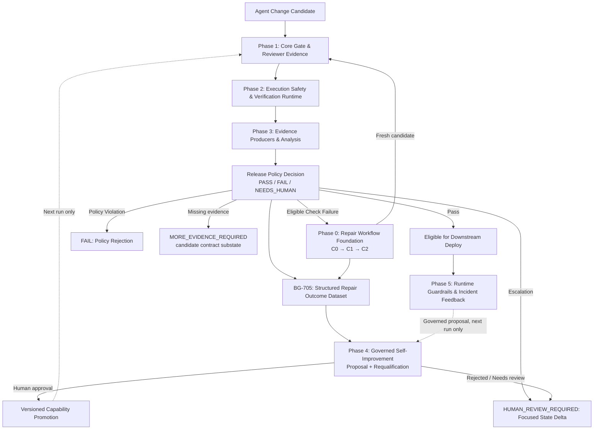

# Release Gate Enhancement Backlog: Mitigating the Agentic Code Review Bottleneck

## Overview & Rationale

As coding agent adoption increases, the constraint in software delivery shifts from **code generation throughput** to the **human cost of acceptance**—the cognitive effort and attention budget required for reviewers to reconstruct system state and safely merge changes.

This backlog captures strategic and tactical enhancements for the **Release Gate**, directly addressing the core operational challenges identified in agentic workflows:
1. **The Review Attention Ceiling:** Attention drops after ~60 minutes and review efficacy degrades sharply above 200–400 lines per session.
2. **The Nature of Agent Drift:** Semantic/architectural erosion and unintended product decisions rather than statistical data drift.
3. **Isolation Weaknesses:** Worktree and filesystem separation alone fail to isolate environment variables, credentials, caches, or network namespaces.
4. **Passive Dashboards vs. Control Loops:** Shifting from observational telemetry to pre-agreed, blocking release policies and verifiable success criteria.

## Implementation Status Audit (2026-08-30)

This audit compares the current `release-gate/src/`, tests, and product documentation with each item's acceptance criteria. “Partial” means a related capability exists but the stated acceptance criteria are not yet satisfied; it should not be treated as complete.

| Status | Items | Evidence / next action |
| :--- | :--- | :--- |
| **Delivered baseline (not previously represented as backlog items)** | Candidate reconstruction and base-trusted policy enforcement; bounded C0 → C1 → C2 repair protocol; tamper-evident evidence packages; rolling decision observability dashboards | Implemented in `src/release_gate/` and documented in `README.md`. These are product foundations, not completion of the enhancement items below. |
| **Partial** | **BG-402**, **BG-502**, **BG-703**, **BG-705** | Versioned result/manifest/trace and verdict precedence exist, but there is no confidence ledger; the policy contract uses `PASS`/`FAIL`/`NEEDS_HUMAN` rather than the backlog's proposed routing states; lesson and outcome artifacts exist but are not yet reusable learning inputs. |
| **Incomplete / blocked** | **BG-704** | Repair integration tests exist, but the suite currently fails before exercising the workflow because `tests/test_repair_integration.py` uses `sys.executable` without importing `sys`. Fix the harness and add guidance/lesson-content assertions. |
| **Not started or explicitly deferred** | **BG-101**, **BG-102**, **BG-201**, **BG-202**, **BG-301**, **BG-302**, **BG-401**, **BG-501**, **BG-503**, **BG-601**, **BG-602**, **BG-603**, **BG-701**, **BG-702**, **BG-801**, **BG-802**, **BG-803**, **BG-901**, **BG-902**, **BG-903** | No implementation satisfies the acceptance criteria. In particular, hard sandboxing, diff budgets, architectural/duplication analysis, code-mode execution, queue throttling, structured CLI guidance, independent evidence producers, downstream runtime feedback, and governed feedback learning remain future work. |

The status labels above are the source of truth for roadmap grooming. Move an item to **Done** only when its acceptance criteria and qualification tests pass; code that merely provides a neighboring foundation stays **Partial**.

---

## Diagram Review Inputs (2026-09-01)

The reviewed SDLC flow places `ChangeExecutionService` before the Release Gate
and labels token compression/model-gateway behavior upstream of the gate. This
matches the intended product boundary: Release Gate evaluates an already-created
candidate patch and must not become the code generator, deployment controller,
or self-modifying policy owner.

Backlog grooming should preserve these lane boundaries:

1. **Upstream change execution** creates the candidate patch. Release Gate may
   measure and reject the patch, but it must not silently change source files
   during normal evaluation.
2. **Token compression and model gateway behavior** are upstream context
   transport concerns. They can affect candidate quality, but they are not
   trusted gate evidence unless their outputs are captured as explicit,
   versioned artifacts.
3. **Evidence producers** such as deterministic tests, independent synthesized
   tests, mutation runs, adversarial cases, static analysis, and architectural
   conformance checks feed the gate. They should not individually decide
   release eligibility.
4. **The gate decision** remains a deterministic policy aggregation over
   recorded evidence: `PASS`, `FAIL`, or `NEEDS_HUMAN`. A future
   `MORE_EVIDENCE_REQUIRED` route may be modeled as a policy substate, but it
   must map cleanly to the stable contract or require a version bump.
5. **Release/deploy/canary/runtime guardrails** are downstream of `PASS`.
   Runtime signals may feed governed policy-learning proposals, but they must
   not retroactively reinterpret a finalized gate verdict.
6. **Human review** is a first-class output, not an exception path. The gate
   should reduce reviewer reconstruction cost by producing focused state-delta,
   provenance, and residual-risk evidence.

These inputs refine the backlog below. They do not change the current v1
security model: repository code still executes on a trusted host until hard
sandbox execution is delivered.

---

## Strategic Epics & Backlog Items



---

### Epic 1: Diff & Blast Radius Budget Gating
**Goal:** Direct enforcement of reviewer cognitive load limits to prevent unreviewable PRs and excessive queue stretching.

| Item ID | Title | Priority | Description & Acceptance Criteria |
| :--- | :--- | :---: | :--- |
| **BG-101** | **Configurable Diff Size & Blast Radius Gate** | High | **Problem:** Massive agent diffs trigger severe reviewer fatigue (>400 lines) and drop defect detection to <70%.<br>**Implementation:** Add a diff budget evaluator into the release gate policy schema (`max_lines_changed`, `max_files_modified`, `max_cyclomatic_complexity_delta`).<br>**Acceptance Criteria:** Gate returns `FAIL` or `HUMAN_REVIEW_REQUIRED` if diff metrics exceed the configured review budget, prompting agent task decomposition. |
| **BG-102** | **Code Duplication & Syntactic Bloat Detector** | Medium | **Problem:** Agents often duplicate boilerplate/logic rather than reusing abstractions, multiplying state-reconstruction overhead.<br>**Implementation:** Add static duplication analysis check comparing candidate patch against base repository AST.<br>**Acceptance Criteria:** Flag or fail changes that introduce duplicate AST blocks beyond configurable similarity thresholds. |

---

### Epic 2: Architectural Conformance & Intent Drift Gating
**Goal:** Detect architectural erosion and unauthorized product/design decisions without triggering alert fatigue.

| Item ID | Title | Priority | Description & Acceptance Criteria |
| :--- | :--- | :---: | :--- |
| **BG-201** | **Architectural Decision Record (ADR) Conformance Evaluator** | High | **Problem:** Agents make subtle architectural deviations that compile and pass unit tests but violate team architectural intent.<br>**Implementation:** Implement an architectural fitness function evaluator that checks candidate diffs against versioned ADRs, task specifications, and package boundary rules.<br>**Acceptance Criteria:** Non-conforming changes emit structured conformance failure findings referencing the violated ADR rule. |
| **BG-202** | **LLM-as-a-Judge Calibration & False-Positive Monitoring** | High | **Problem:** Subjective semantic drift checks can hallucinate or exhibit length/position bias. If false-positive rates exceed 20–30%, teams disable the tool.<br>**Implementation:** Establish a continuous evaluation harness comparing LLM conformance judgments against a gold-standard dataset of human reviews. Track and report the false-positive rate as a gate reliability metric.<br>**Acceptance Criteria:** Drift evaluators cannot run in blocking mode unless their empirical false-positive rate on benchmark sets remains strictly under 15%. |

---

### Epic 3: Deterministic Sandbox & Execution Isolation Boundary
**Goal:** Elevate isolation beyond filesystem clones to prevent host credential leakage, ambient side-effects, and supply chain attacks.

| Item ID | Title | Priority | Description & Acceptance Criteria |
| :--- | :--- | :---: | :--- |
| **BG-301** | **Hard Sandbox Execution Integration (Container / MicroVM)** | High | **Problem:** Worktrees and local clean clones do not isolate process credentials, host daemon sockets, environment variables, or local network services.<br>**Implementation:** Integrate the release gate verifier with container/user-space sandboxes (e.g., OCI containers, Firecracker, or gVisor) with default `deny_all` network egress.<br>**Acceptance Criteria:** Evaluation runs in an isolated ephemeral execution sandbox with stripped environment credentials and strictly bounded resources (CPU, RAM, wall-clock time). |
| **BG-302** | **Credential & Environment Leakage Scanner** | Medium | **Problem:** Agents might accidentally output or commit ambient tokens, secrets, or modified environment configurations.<br>**Implementation:** Pre-gate and post-gate verification that inspects candidate patches, artifacts, and test runner logs for credential patterns and out-of-boundary path writes.<br>**Acceptance Criteria:** Zero token or sensitive environment variable presence in generated evidence directories or candidate diffs. |

---

### Epic 4: Reviewer-Centric Evidence Summarization (Cost-of-Acceptance Reduction)
**Goal:** Restructure the generated evidence to help human reviewers rapidly reconstruct state mutations rather than reading full line diffs.

| Item ID | Title | Priority | Description & Acceptance Criteria |
| :--- | :--- | :---: | :--- |
| **BG-401** | **State-Mutation & Non-Local Side-Effect Delta Summary** | High | **Problem:** Reviewers waste significant time scanning diffs to identify which external dependencies, public contracts, or global states were altered.<br>**Implementation:** Add an evidence summarizer that extracts public API contract changes, database schema alterations, configuration modifications, and cross-module call-graph shifts.<br>**Acceptance Criteria:** `evidence/summary.md` features a high-visibility "System State Delta" section separating mechanical code edits from architectural/state boundary changes. |
| **BG-402** | **Automated Decision Provenance & Confidence Ledger** | Medium | **Problem:** Reviewers need clarity on which portions of the change are 100% verified by deterministic proofs vs. requiring subjective human evaluation.<br>**Implementation:** Include a verification ledger in the gate report categorizing each control: Deterministic Proofs (mutation score, type checks, coverage), Boundary Guarantees (diff budget, sandbox validation), and Subjective Areas requiring review.<br>**Acceptance Criteria:** Reviewers receive an unambiguous list of items requiring manual scrutiny, reducing review time per PR. |

---

### Epic 5: Release Policy & Error Budget Control Loop
**Goal:** Transition gate verdicts into an active, enforceable control loop based on predefined reliability and merge budgets.

| Item ID | Title | Priority | Description & Acceptance Criteria |
| :--- | :--- | :---: | :--- |
| **BG-501** | **Weekly Merge Budget & Review Queue Throttling** | Medium | **Problem:** Generating changes faster than the team's review budget creates toxic review queues and rushed approvals.<br>**Implementation:** Expose team-level review capacity metrics (`merge_budget = review_hours * lines_per_hour`) and gate concurrency throttles in workflow integrations.<br>**Acceptance Criteria:** Workflow integration warns or holds low-priority agent PRs when the active review queue exceeds the calculated weekly review capacity. |
| **BG-502** | **Multi-Tiered Three-Way Gate Policy Engine** | High | **Problem:** Binary pass/fail is insufficient for agent workflows where changes need distinct routing (automatic merge vs. human sign-off vs. additional evidence).<br>**Implementation:** Ensure robust three-way policy evaluation (`PASS`, `FAIL`, `HUMAN_REVIEW_REQUIRED`, `MORE_EVIDENCE_REQUIRED`) based on control severity, metric thresholds, and flake rates.<br>**Acceptance Criteria:** Changes with minor non-blocking advisory warnings are cleanly escalated to human reviewers without blocking unrelated pipeline steps. |
| **BG-503** | **Stable Verdict Contract vs. Workflow Routing Clarification** | High | **Problem:** Architecture diagrams and integrations can conflate the stable v1 verdict contract with richer workflow routing states such as release, deploy, human review, or more-evidence loops.<br>**Implementation:** Document and enforce a translation layer: the engine emits only contract verdicts unless the result schema is versioned; downstream workflow adapters may derive routing labels from verdict, reason codes, severity, and policy metadata.<br>**Acceptance Criteria:** Documentation, schemas, and integration examples distinguish `PASS` from deployment authorization, `NEEDS_HUMAN` from generic failure, and any future `MORE_EVIDENCE_REQUIRED` route from the stable v1 result enum. |

---

### Epic 6: Code Mode Engine for Multi-Step Verification & Tool Calling
**Goal:** Transform tool calling from multi-round "request-response" dialogue (Function Calling / Waiter model) into high-performance, single-script execution (Code Mode / Chef model), eliminating context bloat and enabling native complex logic during evidence collection.

> **Key Architectural Paradigm:** Instead of the model repeatedly querying tools over 8–16 round-trips via individual JSON payloads, Code Mode packages verification tools (git, test suites, coverage engines, AST parsers, artifact scanners) into a unified Python/TypeScript SDK. The model generates a complete script ("the recipe") executed inside an isolated sandbox in a single iteration (67%–88% speedup).

| Item ID | Title | Priority | Description & Acceptance Criteria |
| :--- | :--- | :---: | :--- |
| **BG-601** | **Code Mode Verification SDK & Execution Runtime** | High | **Problem:** Multi-step verification (e.g. running tests, inspecting failures, filtering flaky tests, re-running focused sub-suites, parsing coverage) via traditional Function Calling causes high latency, token bloat, and fragile multi-turn loops.<br>**Implementation:** Expose release gate verification primitives as a typed local Python/TS SDK within a single sandboxed code-runner endpoint (`execute_verification_script`). Allow the agent to write scripts with native loops (`for`, `while`), branches (`if/else`), and data aggregations.<br>**Acceptance Criteria:** Complex verification tasks execute in a single round-trip, yielding a 70%+ reduction in latency and token consumption compared to multi-turn tool calling. |
| **BG-602** | **Hybrid Tool Calling Router (Function Calling vs. Code Mode)** | Medium | **Problem:** Code Mode adds unnecessary overhead for simple 1-step queries, while Function Calling collapses on complex multi-step pipelines.<br>**Implementation:** Implement an intelligent orchestration router: route atomic 1–3 step checks (e.g., fetching a config or validating a single schema) to standard Function Calling; route multi-step diagnostic, bounded repair, and evidence aggregation workflows to Code Mode.<br>**Acceptance Criteria:** Automatic selection of execution mode based on task complexity; structured JSON schemas maintained for simple operations and batch execution scripts for multi-step tasks. |
| **BG-603** | **Code Mode Sandbox Diagnostics & Error Classification** | High | **Problem:** Arbitrary script execution can fail due to syntax errors, runtime sandbox faults, or legitimate verification failures, making automated repair ambiguous.<br>**Implementation:** Build structured sandbox telemetry separating script compilation errors, sandbox permission violations, and actual underlying check failures. Inject sanitized tracebacks back to the agent for one-shot script self-correction.<br>**Acceptance Criteria:** Clear error taxonomy returned to the caller, preventing infinite retry loops and ensuring safe, deterministic failure recovery. |

---

### Epic 7: Governed Self-Improvement & Repair Learning
**Goal:** Turn bounded repair evidence into reviewed, reproducible capability improvements without allowing the release gate to silently modify its own policy or become the developer.

The current Release Gate supports **within-session self-correction** (`C0 → C1 → C2`) only. Cross-session feedback learning, automatic prompt/playbook/benchmark changes, and self-modifying assurance policy are intentionally deferred. The items below define the missing, separately governed learning layer.

| Item ID | Title | Priority | Description & Acceptance Criteria |
| :--- | :--- | :---: | :--- |
| **BG-701** | **Governed Repair Feedback Learning Loop** | High | **Problem:** Repair sessions and rolling observability are recorded, but no later session consumes them to improve diagnosis or repair behavior. **Implementation:** Add a separate learner that consumes repair outcomes, human decisions, rollbacks, incidents, and new failure modes; generate versioned proposals for prompts, playbooks, benchmark cases, or model routing. **Acceptance Criteria:** Proposals are never applied automatically; each has provenance, an approver, a capability version, requalification evidence on a frozen benchmark, and a reversible promotion/rollback record. |
| **BG-702** | **Expose Structured Repair Guidance to the Assistant** | High | **Problem:** `request_repair()` computes check-specific playbook guidance, but the `repair-request` CLI drops it, leaving the assistant with only failed check IDs and paths. **Implementation:** Return guidance plus safe references to the latest result and execution logs, clearly marked as untrusted diagnostic data. **Acceptance Criteria:** CLI and skill contract tests assert that guidance and diagnostic artifact locations reach every repair attempt without expanding approved paths or changing the verdict. |
| **BG-703** | **Persist Accurate Passing-Candidate Lessons** | High | **Problem:** The success lesson proposal is generated from the pre-success session, so it cannot identify the candidate that just passed and is too generic to be reusable. **Implementation:** Generate the proposal from the updated attempt lineage and include failure fingerprint, changed paths, verification evidence, and the successful remediation pattern. **Acceptance Criteria:** A passing `C1`/`C2` proposal names the passing candidate, references its evidence, and is available to the governed learner; failed candidates remain preserved. |
| **BG-704** | **Repair Integration Qualification Health** | High | **Problem:** The repair integration suite currently fails before exercising the workflow because `tests/test_repair_integration.py` uses `sys.executable` without importing `sys`. **Implementation:** Repair the test harness and make the qualification suite run the full C0/C1/C2, repeated-candidate, needs-human, guidance, and lesson-content scenarios. **Acceptance Criteria:** Ruff is clean, all repair integration tests execute (not collection-fail), and CI blocks release qualification on any harness error. |
| **BG-705** | **Structured Repair Outcome Dataset & Lineage** | Medium | **Problem:** `RepairAttempt` stores hashes and verdicts but does not provide a normalized failure fingerprint, human outcome, cost, or causal classification for future analysis. **Implementation:** Add a versioned, append-only repair outcome record linked to every candidate and gate run. **Acceptance Criteria:** Learner inputs distinguish failed, corrected, abandoned, and rolled-back attempts; records include checks, artifacts, paths, timing/token cost where available, and immutable candidate lineage without exposing secrets. |

---

### Epic 8: Independent Evidence Producers & Adversarial Assurance
**Goal:** Make the “independent test synthesis” and “mutation/adversarial analysis” boxes in the SDLC diagram concrete evidence producers while keeping final authority in the deterministic policy engine.

| Item ID | Title | Priority | Description & Acceptance Criteria |
| :--- | :--- | :---: | :--- |
| **BG-801** | **Independent Test Synthesis Evidence Producer** | High | **Problem:** Candidate-authored tests can pass while preserving the agent's blindspot, and synthesized tests are currently represented only as a diagram concept rather than a governed evidence source.<br>**Implementation:** Add an optional producer that generates or selects independent tests from task intent, changed APIs, bug classes, and historical incidents, then executes them in the same isolated gate runtime as other controls.<br>**Acceptance Criteria:** Generated tests are stored as untrusted evidence artifacts with generator version, prompt/input digest, changed-path scope, execution result, and reviewer-visible limitations. The gate decision consumes only the recorded result and configured policy threshold. |
| **BG-802** | **Mutation & Adversarial Case Analysis Producer** | High | **Problem:** Ordinary deterministic tests can miss boundary, negative, and regression cases that are common in agent-generated code.<br>**Implementation:** Add mutation/adversarial runners that create bounded mutants or adversarial fixtures for changed units, prioritize them by blast radius, and report survivor classes without modifying the candidate tree.<br>**Acceptance Criteria:** Evidence identifies killed/surviving mutants, adversarial scenario IDs, affected paths, runtime cost, and policy contribution. Surviving high-severity cases can produce `FAIL` or `NEEDS_HUMAN`; inconclusive runs never produce `PASS`. |
| **BG-803** | **Evidence Producer Registry & Trust Labels** | Medium | **Problem:** As checks expand beyond repository-declared commands, reviewers need to know which evidence came from deterministic tools, generated tests, model judgments, or downstream runtime signals.<br>**Implementation:** Add a producer registry with stable IDs, versions, trust class, determinism class, required sandbox profile, and allowed verdict contribution.<br>**Acceptance Criteria:** `result.json` or an associated evidence summary can group controls by producer and label each as deterministic, bounded-generated, subjective, downstream, or advisory. Blocking policy may only use producer classes explicitly enabled by base-trusted configuration. |

---

### Epic 9: Downstream Runtime Guardrails & Feedback Governance
**Goal:** Connect post-`PASS` deployment/canary/live-guardrail signals back into learning and policy improvement without letting runtime systems mutate finalized gate evidence or silently promote new policy.

| Item ID | Title | Priority | Description & Acceptance Criteria |
| :--- | :--- | :---: | :--- |
| **BG-901** | **Post-PASS Deployment Eligibility Contract** | Medium | **Problem:** Diagrams that end with “Release” can imply the gate deploys software. A `PASS` means the candidate satisfied recorded pre-release policy, not that a deploy controller has executed rollout checks.<br>**Implementation:** Define a downstream handoff contract that carries verdict, candidate tree, evidence manifest digest, policy digest, and residual-risk summary to CI/CD systems without granting the gate deployment authority.<br>**Acceptance Criteria:** Integration docs and examples use “eligible for downstream deployment” language and require deploy systems to make their own environment, rollout-window, and approval checks. |
| **BG-902** | **Runtime Guardrail Signal Ingestion** | Medium | **Problem:** Live incidents, rollback triggers, SLO breaches, and canary failures are valuable learning inputs but are outside current gate evidence and verdict finalization.<br>**Implementation:** Add an append-only ingestion format for downstream runtime signals linked to candidate tree, release artifact, gate run ID, and deployed environment.<br>**Acceptance Criteria:** Runtime signals cannot alter a completed `result.json`; they can create governed learning proposals, benchmark additions, policy-review tasks, or reviewer warnings for future runs. |
| **BG-903** | **Rollback and Incident Outcome Correlation** | Medium | **Problem:** Without correlation between gate evidence and production outcomes, teams cannot tell which blindspots escaped the gate or whether new checks reduce real incidents.<br>**Implementation:** Correlate rollback, hotfix, incident, and human-review outcomes with gate controls, producer classes, diff metrics, and repair lineage.<br>**Acceptance Criteria:** Periodic reports identify escaped-defect classes, false-positive controls, missing evidence producers, and candidate patterns that should update benchmarks or policy proposals through BG-701. |

## Implementation Roadmap

```
Phase 0: Repair Workflow Foundation (qualification prerequisite)
├── BG-704: Repair Integration Qualification Health
├── BG-702: Structured Repair Guidance Channel
├── BG-703: Accurate Passing-Candidate Lessons
└── BG-705: Structured Repair Outcome Dataset & Lineage

Phase 1: Core Gate & Reviewer Evidence (Q1)
├── BG-502: Multi-Tiered Three-Way Policy Engine
├── BG-101: Diff Size & Blast Radius Gates
├── BG-401: System State Mutation Summaries
├── BG-402: Decision Provenance & Confidence Ledger
└── BG-501: Review Budget Capacity Throttling

Phase 2: Execution Safety & Verification Runtime (Q2)
├── BG-301: Container/MicroVM Sandbox Integration
├── BG-302: Credential & Environment Leakage Scanner
├── BG-601: Code Mode Verification SDK & Runtime
└── BG-603: Code Mode Sandbox Diagnostics & Error Taxonomy

Phase 3: Analysis & Orchestration (Q3)
├── BG-102: Code Duplication & Bloat Detection
├── BG-201: ADR Conformance Evaluator
├── BG-202: LLM Judge Calibration & FP Tracking (<15% target)
├── BG-602: Hybrid Tool Calling Router (Function vs Code Mode)
├── BG-801: Independent Test Synthesis Evidence Producer
├── BG-802: Mutation & Adversarial Case Analysis Producer
└── BG-803: Evidence Producer Registry & Trust Labels

Phase 4: Governed Self-Improvement (after qualification controls)
└── BG-701: Governed Repair Feedback Learning Loop

Phase 5: Downstream Runtime Feedback (post-PASS integration)
├── BG-503: Stable Verdict Contract vs. Workflow Routing Clarification
├── BG-901: Post-PASS Deployment Eligibility Contract
├── BG-902: Runtime Guardrail Signal Ingestion
└── BG-903: Rollback and Incident Outcome Correlation
```
