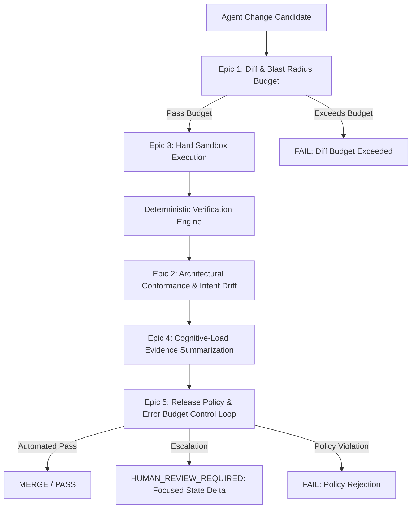

# Release Gate Enhancement Backlog: Mitigating the Agentic Code Review Bottleneck

## Overview & Rationale

As coding agent adoption increases, the constraint in software delivery shifts from **code generation throughput** to the **human cost of acceptance**—the cognitive effort and attention budget required for reviewers to reconstruct system state and safely merge changes.

This backlog captures strategic and tactical enhancements for the **Release Gate**, directly addressing the core operational challenges identified in agentic workflows:
1. **The Review Attention Ceiling:** Attention drops after ~60 minutes and review efficacy degrades sharply above 200–400 lines per session.
2. **The Nature of Agent Drift:** Semantic/architectural erosion and unintended product decisions rather than statistical data drift.
3. **Isolation Weaknesses:** Worktree and filesystem separation alone fail to isolate environment variables, credentials, caches, or network namespaces.
4. **Passive Dashboards vs. Control Loops:** Shifting from observational telemetry to pre-agreed, blocking release policies and verifiable success criteria.

---

## Strategic Epics & Backlog Items



---

### Epic 1: Diff & Blast Radius Budget Gating
**Goal:** Direct enforcement of reviewer cognitive load limits to prevent unreviewable PRs and excessive queue stretching.

| Item ID | Title | Priority | Description & Acceptance Criteria |
| :--- | :--- | :---: | :--- |
| **BG-101** | **Configurable Diff Size & Blast Radius Gate** | High | **Problem:** Massive agent diffs trigger severe reviewer fatigue (>400 lines) and drop defect detection to <70%.<br>**Implementation:** Add a diff budget evaluator into the release gate policy schema (`max_lines_changed`, `max_files_modified`, `max_cyclomatic_complexity_delta`).<br>**Acceptance Criteria:** Gate returns `FAIL` or `HUMAN_REVIEW_REQUIRED` if diff metrics exceed the configured review budget, prompting agent task decomposition. |
| **BG-102** | **Code Duplication & Syntactic Bloat Detector** | Medium | **Problem:** Agents often duplicate boilerplate/logic rather than reusing abstractions, multiplying state-reconstruction overhead.<br>**Implementation:** Add static duplication analysis check comparing candidate patch against base repository AST.<br>**Acceptance Criteria:** Flag or fail changes that introduce duplicate AST blocks beyond configurable similarity thresholds. |

---

### Epic 2: Architectural Conformance & Intent Drift Gating
**Goal:** Detect architectural erosion and unauthorized product/design decisions without triggering alert fatigue.

| Item ID | Title | Priority | Description & Acceptance Criteria |
| :--- | :--- | :---: | :--- |
| **BG-201** | **Architectural Decision Record (ADR) Conformance Evaluator** | High | **Problem:** Agents make subtle architectural deviations that compile and pass unit tests but violate team architectural intent.<br>**Implementation:** Implement an architectural fitness function evaluator that checks candidate diffs against versioned ADRs, task specifications, and package boundary rules.<br>**Acceptance Criteria:** Non-conforming changes emit structured conformance failure findings referencing the violated ADR rule. |
| **BG-202** | **LLM-as-a-Judge Calibration & False-Positive Monitoring** | High | **Problem:** Subjective semantic drift checks can hallucinate or exhibit length/position bias. If false-positive rates exceed 20–30%, teams disable the tool.<br>**Implementation:** Establish a continuous evaluation harness comparing LLM conformance judgments against a gold-standard dataset of human reviews. Track and report the false-positive rate as a gate reliability metric.<br>**Acceptance Criteria:** Drift evaluators cannot run in blocking mode unless their empirical false-positive rate on benchmark sets remains strictly under 15%. |

---

### Epic 3: Deterministic Sandbox & Execution Isolation Boundary
**Goal:** Elevate isolation beyond filesystem clones to prevent host credential leakage, ambient side-effects, and supply chain attacks.

| Item ID | Title | Priority | Description & Acceptance Criteria |
| :--- | :--- | :---: | :--- |
| **BG-301** | **Hard Sandbox Execution Integration (Container / MicroVM)** | High | **Problem:** Worktrees and local clean clones do not isolate process credentials, host daemon sockets, environment variables, or local network services.<br>**Implementation:** Integrate the release gate verifier with container/user-space sandboxes (e.g., OCI containers, Firecracker, or gVisor) with default `deny_all` network egress.<br>**Acceptance Criteria:** Evaluation runs in an isolated ephemeral execution sandbox with stripped environment credentials and strictly bounded resources (CPU, RAM, wall-clock time). |
| **BG-302** | **Credential & Environment Leakage Scanner** | Medium | **Problem:** Agents might accidentally output or commit ambient tokens, secrets, or modified environment configurations.<br>**Implementation:** Pre-gate and post-gate verification that inspects candidate patches, artifacts, and test runner logs for credential patterns and out-of-boundary path writes.<br>**Acceptance Criteria:** Zero token or sensitive environment variable presence in generated evidence directories or candidate diffs. |

---

### Epic 4: Reviewer-Centric Evidence Summarization (Cost-of-Acceptance Reduction)
**Goal:** Restructure the generated evidence to help human reviewers rapidly reconstruct state mutations rather than reading full line diffs.

| Item ID | Title | Priority | Description & Acceptance Criteria |
| :--- | :--- | :---: | :--- |
| **BG-401** | **State-Mutation & Non-Local Side-Effect Delta Summary** | High | **Problem:** Reviewers waste significant time scanning diffs to identify which external dependencies, public contracts, or global states were altered.<br>**Implementation:** Add an evidence summarizer that extracts public API contract changes, database schema alterations, configuration modifications, and cross-module call-graph shifts.<br>**Acceptance Criteria:** `evidence/summary.md` features a high-visibility "System State Delta" section separating mechanical code edits from architectural/state boundary changes. |
| **BG-402** | **Automated Decision Provenance & Confidence Ledger** | Medium | **Problem:** Reviewers need clarity on which portions of the change are 100% verified by deterministic proofs vs. requiring subjective human evaluation.<br>**Implementation:** Include a verification ledger in the gate report categorizing each control: Deterministic Proofs (mutation score, type checks, coverage), Boundary Guarantees (diff budget, sandbox validation), and Subjective Areas requiring review.<br>**Acceptance Criteria:** Reviewers receive an unambiguous list of items requiring manual scrutiny, reducing review time per PR. |

---

### Epic 5: Release Policy & Error Budget Control Loop
**Goal:** Transition gate verdicts into an active, enforceable control loop based on predefined reliability and merge budgets.

| Item ID | Title | Priority | Description & Acceptance Criteria |
| :--- | :--- | :---: | :--- |
| **BG-501** | **Weekly Merge Budget & Review Queue Throttling** | Medium | **Problem:** Generating changes faster than the team's review budget creates toxic review queues and rushed approvals.<br>**Implementation:** Expose team-level review capacity metrics (`merge_budget = review_hours * lines_per_hour`) and gate concurrency throttles in workflow integrations.<br>**Acceptance Criteria:** Workflow integration warns or holds low-priority agent PRs when the active review queue exceeds the calculated weekly review capacity. |
| **BG-502** | **Multi-Tiered Three-Way Gate Policy Engine** | High | **Problem:** Binary pass/fail is insufficient for agent workflows where changes need distinct routing (automatic merge vs. human sign-off vs. additional evidence).<br>**Implementation:** Ensure robust three-way policy evaluation (`PASS`, `FAIL`, `HUMAN_REVIEW_REQUIRED`, `MORE_EVIDENCE_REQUIRED`) based on control severity, metric thresholds, and flake rates.<br>**Acceptance Criteria:** Changes with minor non-blocking advisory warnings are cleanly escalated to human reviewers without blocking unrelated pipeline steps. |

---

## Implementation Roadmap

```
Phase 1: Cognitive Load Reduction & Gating (Q1)
├── BG-101: Diff Size & Blast Radius Gates
├── BG-401: System State Mutation Summaries
└── BG-502: Multi-Tiered Three-Way Policy Engine

Phase 2: Security & Isolation Hardening (Q2)
├── BG-301: Container/MicroVM Sandbox Integration
├── BG-302: Credential & Environment Leakage Scanner
└── BG-102: Code Duplication & Bloat Detection

Phase 3: Semantic Conformance & Operational Tuning (Q3)
├── BG-201: ADR Conformance Evaluator
├── BG-202: LLM Judge Calibration & FP Tracking (<15% target)
├── BG-402: Decision Provenance & Confidence Ledger
└── BG-501: Review Budget Capacity Throttling
```
